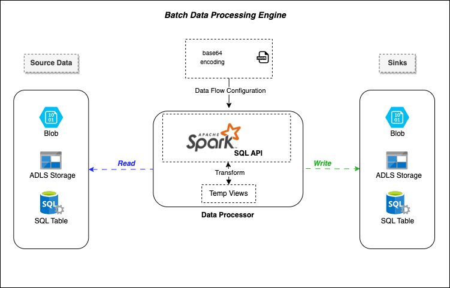
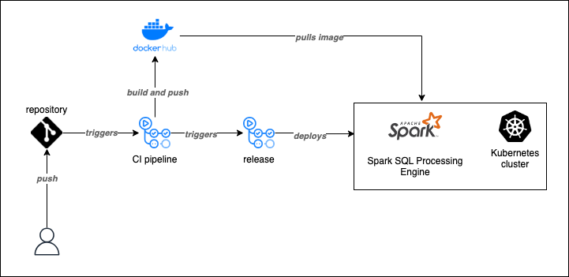

# Batch Data Processing Engine

# Introduction
This document describes a data processing engine used to collect data in batches from different sources, process that data and then write it down towards one of many possible sinks. The engine is built with Python on top of the Spark framework using its SQL API.
Data Processing logic and Data Flows setup are enhanced, enabling a better experience compared to the DataFrame-based engine implementation (c.f. [DataFrame Processing Engine](https://github.com/nassim-bouali/Data_Spark_DF_Engine_Java)). More details will be discussed later in section [2.1](#21-engine-features) below.

## 1) Architecture


## 2) Data Processing Engine

### 2.1) Engine Features
The engine is a Spark application that enables reading data from different types of inputs:
- CSV
- Parquet
- SQL Table
- Azure Data Lake Storage Blobs

Later in the process, the input read data gets transformed and then could be written to the following set of outputs:
- CSV
- Parquet
- SQL Table
- Azure Data Lake Storage Blobs

Since this engine's version uses Spark SQL as a main Data Processing API, transformations are then handled through Spark Temporary Views.
These lazy evaluated programming abstractions are derived from Data Flows configuration templates. More details can be found about Data Flows setup in the next section.

Leveraging Spark SQL API as a backbone for Data Processing needs along with explicit Data Flow configuration makes this engine:
1. Convenient to customized data processing needs without requiring additional logic implementation
2. Reliable also for data analysts/scientists
3. Externally managed with ease

### 2.2) Data Flow Configuration
Each application run requires a Data Flow to be pre-configured. A Data Flow can be setup as follows:

| Field           | Type                         | Description                                                               |
|-----------------|------------------------------|---------------------------------------------------------------------------|
| inputs          | list of Storage class        | Defines one or many sources of data                                       |
| transformations | list of Transformation class | Defines one or many sql transformations to be applied on the given inputs |
| targets         | list of Target class         | Defines one or many data sinks                                            |

- Class definitions
  - **Storage**
    - **_id_**: A unique string defining the temporary view name
    - **_json_type_**: Subclass name declaring the storage type (csv, parquet or jdbc)
    - **_path_**: Path towards the data source
    - **_options_**: A map consisting of options to be applied on the source data (e.g. delimiter...)
    - **_storage_account_**: Storage account name
    - **_container_**: Container name
    - **_sas_token_**: Shared access key
    - **_table_**: DB table name
    - **_uri_**: DB table URl
  - **Transformation**
    - **_id_**: A unique string defining the transformation temporary view name
    - **_sql_**: Sql query defining the transformation temporary view content
  - **Target**
    - **_from_sql_query_**: Source temporary view id referring to one of the defined inputs or transformations
    - **_Storage_**: An instance of the Storage class defining the data sink details

### 2.3) Deployment process
The engine's continuous integration and continuation deployment process consists of two main steps:
1. Building and pushing a docker image containing the application's source code along with the required Python and Spark packages.
2. Deploying the previous cited docker image into a staging Kubernetes cluster.

Both workflows are handled through a gitHub action. Template can be found under:
- [CI/CD pipeline](.github/workflows/full-pipeline.yml)



# Local Setup
Once the repository is cloned, you can navigate first towards the project's root directory.

```bash
# replace this path with the appropriate one depending on your project's location
cd /path/to/project
```
## Docker Deployment
Run the following command in order to run the application within a docker container.
Make sure to replace the command argument with the appropriate absolute path towards your resources folders.
```bash
# replace both arguments
bash buildAndRun.sh /path/to/project/resources
```
## Kubernetes Release
If you have a kubernetes cluster, you can also use the project's deployment template to run a pod in order to execute the application.
The example below covers the deployment steps into a local minikube cluster.

Start first with mounting your local repository resources directory to the appropriate minikube file system.
```bash
# replace the mounted path directory with the appropriate location
minikube mount /path/to/project/resources:/resources
```
Apply kubernetes deployment template
```bash
# deploy to kubernetes
kubectl apply -f deploy/local/batch-sql-processing-engine-deployment.yaml
```
Consult application logs
```bash
# replace the pod id
kubectl logs -f POD_ID
```